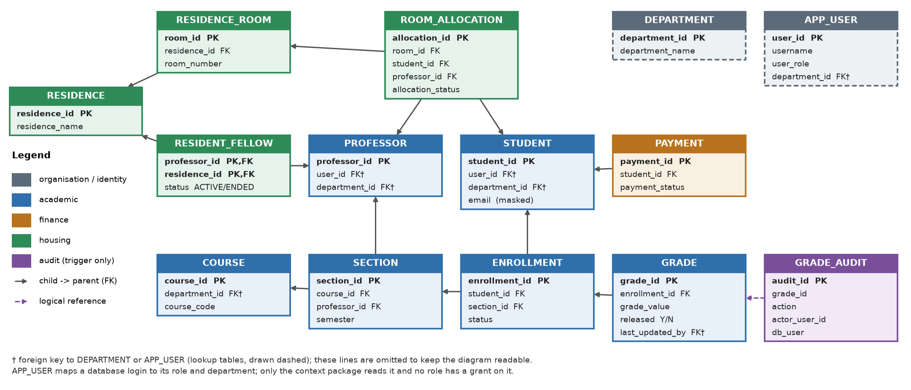
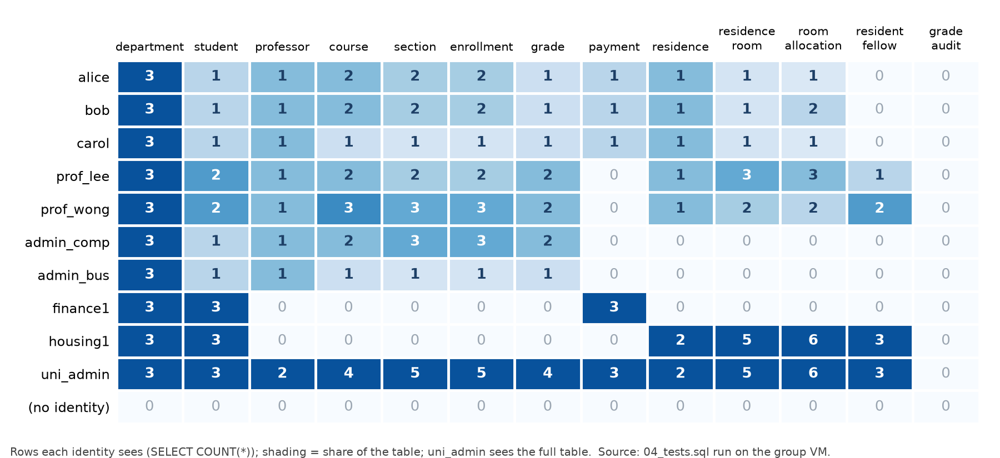

<div class="cover">
<p class="course">CS5322 Database Security &middot; Project I</p>
<h1 class="title">Virtual Private Database<br>for a University Information System</h1>
<p class="subtitle">Row-level, column-level and write-path access control with Oracle VPD</p>
<p class="meta">Group 5 &middot; October 2026</p>
{{TEAM_COVER}}
<p class="env">Implemented and verified on Oracle AI Database 26ai Free (23.26.2),<br>pluggable database <code>CS5322</code> of the group virtual machine.</p>
</div>

::: twocol

# Introduction

Table-level grants cannot express most rules of a university information system. Students, professors, administrators and officers all query the same tables, yet each must see different rows, sometimes different columns, and may change different rows. Oracle Virtual Private Database (VPD) lets the database enforce such rules itself: a trusted _application context_ carries the caller's identity, _policy functions_ turn that identity into a SQL predicate, and Oracle appends the predicate to every statement that touches a protected table. The rules therefore cannot be skipped by an application bug or by hand-written SQL.

We hypothesise a university information system with six user roles over fourteen tables (students, professors, courses and their _sections_, enrolments, grades, payments and student housing). Its security policy goes beyond "users see their own rows": department scope is derived through _section → course_, professors see their class lists, grades are drafts until a department administrator publishes them, a _resident fellow_ sees the residents of the residence he currently looks after, and finance sees students but not their e-mail addresses.

The implementation consists of **27 VPD policies on 13 tables** (13 read policies, 13 write policies and one column-level policy), a trusted context package, two triggers and an audit table. **190 automated checks** (49 with simulated identities, 141 with real database logins) all pass; switching a policy off makes the matching checks fail. Everything was deployed and verified on the group's Oracle VM (Oracle AI Database 26ai Free 23.26.2, pluggable database `CS5322`).

# Application and users

The system serves six kinds of users (Table 1). Each person has an own database account; the account name is mapped to an application role and department in the table `APP_USER`.

| Role                     | Accounts                                            | Business need                                                  |
| :----------------------- | :-------------------------------------------------- | :------------------------------------------------------------- |
| Student                  | alice (Computing), bob (Business), carol (Medicine) | own academic, payment and housing records                      |
| Professor                | prof_lee (Computing), prof_wong (Business)          | teach sections, grade students; both are also resident fellows |
| Department administrator | admin_comp, admin_bus                               | manage the records of one department, publish grades           |
| Finance officer          | finance1                                            | process payments; no academic data                             |
| Housing officer          | housing1                                            | allocate rooms; no academic or payment data                    |
| University administrator | uni_admin                                           | read-only oversight, including the audit trail                 |

: Table 1. Roles and demo accounts.

The dummy data is small but contains the edge cases the policies must handle: CS5322 is offered twice by different professors (S1 Lee, S2 Wong), so a professor must see only his own offering; Bob (Business) takes the Computing course CS5322 S2 taught by a Business professor; Carol lives in Lee's residence without being in his class; Alice's second grade is still a draft; Wong's former fellowship of Kent Ridge Hall and Bob's old room allocation have ended. In total: 3 departments, 3 students, 2 professors, 4 courses, 5 sections, 5 enrolments, 4 grades, 3 payments, 2 residences, 5 rooms, 6 allocations and 3 fellowship records.

# Database design

::: wide

:::

`COURSE` is the catalogue entry; `SECTION` is one _offering_ (course, professor, term, room). Teaching assignments live in `SECTION`, so policies can tell two professors teaching the same course apart. `ENROLLMENT` references a section, not a course. `GRADE` references an enrolment and carries a `RELEASED` flag (draft or published). `ROOM_ALLOCATION` assigns a room to a student or to a professor acting as resident fellow (a check constraint demands exactly one occupant); `RESIDENT_FELLOW` records which residence a professor currently looks after (status `ACTIVE`/`ENDED`). `GRADE_AUDIT` is filled only by a trigger. Primary, foreign and unique keys and check constraints (for example the grade domain and the status values) are declared in the schema.

# Security requirements and threat model

We defend against four kinds of adversary: (T1) an authorised user who runs arbitrary SQL with his own account, for example a curious student with SQL\*Plus; (T2) a user who tries to act as somebody else or to escalate his role; (T3) a defect or SQL injection in an application that connects with these accounts; (T4) an administration mistake that grants a role too much. The DBA, the operating system and network eavesdropping are out of scope (Section 9). Table 2 lists the requirements, the policy objects that enforce each of them and the test suites that check it.

::: {.wide .split}
| ID | Requirement | Enforced by | Tested in |
|:-----|:--------------------------------------------------------------------|:--------------------------------------------------|:---------|
| SR1 | A student reads only his own student, enrolment, payment and housing rows. | `STUDENT_VPD`, `ENROLLMENT_VPD`, `PAYMENT_VPD`, `ROOM_ALLOCATION_VPD` | 06, 07 |
| SR2 | A student sees only the sections he is enrolled in, their courses and instructors. | `SECTION_VPD`, `COURSE_VPD`, `PROFESSOR_VPD` | 06, 07 |
| SR3 | A student sees a grade only after it has been released. | `GRADE_VPD` | 06, 07 |
| SR4 | A professor sees his own sections (not other offerings of the same course), their enrolments, grades (drafts included) and class list. | `SECTION_VPD`, `ENROLLMENT_VPD`, `GRADE_VPD`, `STUDENT_VPD` | 06, 07 |
| SR5 | A professor may create or edit only _draft_ grades of his own sections; he cannot publish a grade, change a published one or delete one. | `GRADE_WRITE_VPD`; no DELETE grant | 08 |
| SR6 | A department administrator manages courses, sections, enrolments, students and grades of his department only, cannot move a record out of it, publishes and corrects grades, and deletes only drafts. | `*_WRITE_VPD`, `GRADE_DELETE_VPD` | 08 |
| SR7 | Finance officers reads all payments and student names (not e-mail), records payments and never sees grades. | `PAYMENT_VPD`, `PAYMENT_WRITE_VPD`, `STUDENT_EMAIL_MASK_VPD`; no grant on `GRADE` | 06, 07, 08 |
| SR8 | Housing officers read and manage all housing data and nothing academic or financial. | `RESIDENCE*_VPD`, `ROOM_ALLOCATION_*`; grants | 07, 08 |
| SR9 | A resident fellow sees the residence he _currently_ looks after: rooms, active allocations and the residents' names. An ended assignment grants nothing. | `RESIDENT_FELLOW`, `RESIDENCE*_VPD`, `ROOM_ALLOCATION_VPD`, `STUDENT_VPD` | 06, 07 |
| SR10 | A student sees only his current residence and room and his own allocation history. | `RESIDENCE_VPD`, `RESIDENCE_ROOM_VPD`, `ROOM_ALLOCATION_VPD` | 06, 07 |
| SR11 | University administrators read everything, including the audit trail, and write nothing. | grants, `GRADE_AUDIT_VPD` | 07, 08 |
| SR12 | A missing or invalid identity returns no rows and permits no write. | every policy function returns `1=0` | 06, 07, 08 |
| SR13 | A database user cannot act as another application user. | `CS5322_SECURITY_CTX.SET_USER` | 07 |
| SR14 | Write rules hold even if a privilege is granted by mistake, and every new row is validated. | `*_WRITE_VPD` with `update_check` | 08, 09 |
| SR15 | The recorded editor of a grade cannot be spoofed; every grade change is audited with the real actor. | `GRADE_EDITOR_TRG`, `GRADE_AUDIT_TRG` | 06, 08 |
| SR16 | Contact data (e-mail) is hidden from roles without a need for it. | `STUDENT_EMAIL_MASK_VPD` (column level) | 06, 07 |

: Table 2. Security requirements, enforcement and tests (06 = matrix, 07 = real-user reads, 08 = real-user writes, 09 = defense in depth).
:::

# VPD design

## Trusted identity

Authentication is delegated to the database: every person logs in with an own account. The application then calls `CS5322_SECURITY_CTX.SET_USER`. This package is the only code allowed to write the context namespace `CS5322_APP_CTX` (Oracle enforces this through `CREATE CONTEXT ... USING`). It looks the account up in `APP_USER` and stores `USER_ID`, `ROLE` and `DEPARTMENT_ID`. A normal account can activate only its own name (Listing 1); any other name raises `ORA-20002`. The schema owner, `SYS` and `SYSTEM` may activate any name so that the test scripts can simulate users. **Without an identity the role is NULL and every policy returns `1=0`**: the system fails closed for reads and writes. Figure 2 shows how a statement travels from the login to the rewritten query.

```sql
IF v_session_user NOT IN ('CS5322_P1','SYS','SYSTEM')
   AND v_session_user <> UPPER(p_username) THEN
  RAISE_APPLICATION_ERROR(-20002,
    'Session user cannot impersonate another application user');
END IF;
```

<p class="caption">Listing 1. Impersonation check in <code>SET_USER</code>.</p>

::: wide

:::

## Policy construction

Each policy function is a short `CASE` over the role. The fragments it needs — "my student id", "my professor id", "the sections of my department", "the residences I look after" — are built by the helper package `CS5322_VPD_HELPER`, so all policies are written the same way, and every value spliced into a predicate is a number read from the context, never user input. Scope is _derived from the schema_, not taken from submitted values: department scope runs through `SECTION → COURSE.department_id`, a professor's scope through `SECTION.professor_id`, a student's through `ENROLLMENT`. All policies are `CONTEXT_SENSITIVE`: the predicate depends only on the context, so Oracle re-runs a policy function only when the context changes. Listing 2 is the policy that governs grade writes.

```sql
CREATE OR REPLACE FUNCTION grade_write_fn(
  p_schema VARCHAR2, p_object VARCHAR2)
RETURN VARCHAR2 IS
BEGIN
  RETURN CASE cs5322_vpd_helper.ctx_role
    WHEN 'PROFESSOR' THEN
      'released = ''N'' AND enrollment_id IN '
      || cs5322_vpd_helper.professor_enrollments
    WHEN 'DEPT_ADMIN' THEN
      'enrollment_id IN '
      || cs5322_vpd_helper.dept_enrollments
    ELSE '1=0' END;
END;
```

<p class="caption">Listing 2. Write policy of <code>GRADE</code> (insert and update).</p>

## Policy matrices

Every table has a `SELECT` policy and a separate policy for `INSERT/UPDATE/DELETE` that denies by default and validates the _new_ row (`update_check`). Tables 3 and 4 summarise the rows each role can read and write; Table 5 shows the coarser layer underneath, the object privileges. A `-` means no rows (`1=0`) or no privilege.

::: wide
| Table | Student | Professor | Dept admin | Finance | Housing | Univ. admin |
|:--------------------|:--------------|:----------------------|:----------------|:-----------|:----------------|:-----|
| `STUDENT` | own row | students of his sections + residents of his residence (fellow) | own department | all rows, e-mail masked | students with a room allocation | all |
| `PROFESSOR` | instructors of his sections | own row | own department | - | - | all |
| `COURSE` | courses of his sections | courses of his sections | own department | - | - | all |
| `SECTION` | his sections | his sections | sections of own department's courses | - | - | all |
| `ENROLLMENT` | own | his sections | own department's sections | - | - | all |
| `GRADE` | own, **released only** | his sections, drafts included | own department's | - | - | all |
| `PAYMENT` | own | - | - | all | - | all |
| `RESIDENCE`, `RESIDENCE_ROOM` | current residence / room | those he looks after | - | - | all | all |
| `ROOM_ALLOCATION` | own (history too) | active allocations of his residence | - | - | all | all |
| `RESIDENT_FELLOW` | - | own assignments | - | - | all | all |
| `GRADE_AUDIT` | - | - | - | - | - | all |
| `DEPARTMENT` | all | all | all | all | all | all |

: Table 3. Read policies (`<TABLE>_VPD`): rows visible to each role.

| Table                                                                       | Who may write         | Row scope                                                            |
| :-------------------------------------------------------------------------- | :-------------------- | :------------------------------------------------------------------- |
| `STUDENT`, `COURSE`                                                         | dept admin            | own department; a row cannot be moved to another department          |
| `SECTION`, `ENROLLMENT`                                                     | dept admin            | course / section belongs to the own department                       |
| `GRADE` insert, update                                                      | professor             | draft of his own section, which must stay a draft of his own section |
| `GRADE` insert, update                                                      | dept admin            | any grade of his department (publishes, corrects)                    |
| `GRADE` delete                                                              | dept admin            | drafts of his department only; a published grade is permanent        |
| `PAYMENT`                                                                   | finance (no delete)   | all payments                                                         |
| `ROOM_ALLOCATION`                                                           | housing (no delete)   | all allocations                                                      |
| `DEPARTMENT`, `PROFESSOR`, `RESIDENCE`, `RESIDENCE_ROOM`, `RESIDENT_FELLOW` | nobody                | -                                                                    |
| `GRADE_AUDIT`                                                               | nobody (trigger only) | -                                                                    |

: Table 4. Write policies (`<TABLE>_WRITE_VPD`, `GRADE_DELETE_VPD`).

| Table                                        | Student | Professor | Dept admin | Finance          | Housing          | Univ. admin    |
| :------------------------------------------- | :------ | :-------- | :--------- | :--------------- | :--------------- | :------------- |
| `DEPARTMENT`                                 | S       | S         | S          | S                | S                | S              |
| `STUDENT`, `COURSE`, `SECTION`, `ENROLLMENT` | S       | S         | S I U D    | S (student only) | S (student only) | S              |
| `PROFESSOR`                                  | S       | S         | S          | -                | -                | S              |
| `GRADE`                                      | S       | S I U     | S I U D    | -                | -                | S              |
| `PAYMENT`                                    | S       | -         | -          | S I U            | -                | S              |
| `RESIDENCE`, `RESIDENCE_ROOM`                | S       | S         | -          | -                | S                | S              |
| `ROOM_ALLOCATION`                            | S       | S         | -          | -                | S I U            | S              |
| `RESIDENT_FELLOW`                            | -       | S         | -          | -                | S                | S              |
| `GRADE_AUDIT`, `APP_USER`                    | -       | -         | -          | -                | -                | S (audit only) |

: Table 5. Object privileges per role (S select, I insert, U update, D delete). Finance and housing hold `SELECT` on `STUDENT` only; nobody holds a privilege on `APP_USER`.
:::

## Four policies worth explaining

**Class list and residents.** A professor's predicate on `STUDENT` is an `OR` of two subqueries: students enrolled in his sections, and students with an active allocation in a room of a residence he currently looks after. Lee therefore sees Alice (his class) and Carol (his resident but not his student) but not Bob. Because VPD also rewrites the subqueries, the nested `ENROLLMENT`, `SECTION` and `ROOM_ALLOCATION` policies apply inside the predicate. Table 6 shows the predicates Oracle appends in a few cases; the last row is the fail-closed case.

**Grade workflow.** A grade is a draft (`RELEASED = 'N'`) until the department administrator publishes it. The student policy adds `released = 'Y'`. The professor's write policy requires `released = 'N'` and, through `update_check`, applies to the new row as well: the predicate that lets Lee edit a draft also forbids setting `released` to `'Y'` (`ORA-28115`) and hides published grades from `UPDATE` (0 rows). Separation of duties follows without any extra code.

**Column-level masking.** `STUDENT_EMAIL_MASK_VPD` (Listing 3) is registered with `sec_relevant_cols => 'EMAIL'` and `ALL_ROWS`. Finance still sees every student row (it needs names to reconcile payments), but the e-mail column comes back `NULL`.

**Resident fellow — a design lesson.** Our first design derived a fellow's residence from his own row in `ROOM_ALLOCATION`. A policy on `ROOM_ALLOCATION` then queried `ROOM_ALLOCATION`, and Oracle rejects such self-referencing predicates with `ORA-28113`; running the verification script on the VM exposed it for every housing table. The fellowship is now a table of its own (`RESIDENT_FELLOW`, with a status), so no policy queries the table it protects, and an _ended_ assignment is simply ignored by the predicates.

::: {.wide .pred}
| Identity | Policy | Predicate appended by Oracle (returned by the policy function) |
|:-----------|:----------------------|:--------------------------------------------------------------------------|
| alice | `STUDENT_VPD` | `user_id = 1001` |
| alice | `GRADE_VPD` | `released = 'Y' AND enrollment_id IN (SELECT e.enrollment_id FROM enrollment e WHERE e.student_id = (SELECT student_id FROM student WHERE user_id = 1001))` |
| prof_lee | `GRADE_WRITE_VPD` | `released = 'N' AND enrollment_id IN (SELECT e.enrollment_id FROM enrollment e WHERE e.section_id IN (SELECT x.section_id FROM section x WHERE x.professor_id = (SELECT professor_id FROM professor WHERE user_id = 2001)))` |
| prof_lee | `ROOM_ALLOCATION_VPD` | `(allocation_status = 'ACTIVE' AND room_id IN (SELECT rr.room_id FROM residence_room rr WHERE rr.residence_id IN (SELECT rf.residence_id FROM resident_fellow rf WHERE rf.status = 'ACTIVE' AND rf.professor_id = (SELECT professor_id FROM professor WHERE user_id = 2001))))` |
| admin_comp | `SECTION_VPD` | `course_id IN (SELECT c.course_id FROM course c WHERE c.department_id = 10)` |
| finance1 | `STUDENT_VPD` / `STUDENT_EMAIL_MASK_VPD` | `1=1` / `1=0` (all rows; e-mail masked) |
| (no identity) | any policy | `1=0` |

: Table 6. Predicates generated for selected identities (`04b_show_predicates.sql` on the VM).
:::

## Triggers and defense in depth

Privileges, VPD and triggers are independent layers. Roles hold only the object privileges they need (Table 5), and the write policies would still stop a role that was granted too much: script 09 grants `INSERT, UPDATE, DELETE` on `GRADE` to the student role and shows that Alice changes 0 rows and cannot insert. A `BEFORE` trigger (Listing 4) overwrites `LAST_UPDATED_BY` with the authenticated user, so a writer cannot spoof it, and an `AFTER` trigger records every grade change (old and new value, actor, database user, time) in `GRADE_AUDIT`, which only the university administrator can read.

**Attacks on the mechanism itself.** Two attempts against the identity and the predicates were turned into regression tests. A user cannot forge the context by calling `DBMS_SESSION.SET_CONTEXT` himself: the namespace is bound to the package, and Oracle answers `ORA-01031`. A user who is allowed to create tables cannot hijack the unqualified table names inside a predicate (`enrollment`, `student`, ...) by creating look-alike tables: Oracle resolves them in the schema of the protected table, so a fake `ENROLLMENT` table in Alice's schema, claiming that Bob's and Carol's enrolments are hers, changes nothing (script 09).

```sql
DBMS_RLS.ADD_POLICY(
  object_schema   => USER,
  object_name     => 'STUDENT',
  policy_name     => 'STUDENT_EMAIL_MASK_VPD',
  function_schema => USER,
  policy_function => 'STUDENT_EMAIL_MASK_FN',
  statement_types => 'SELECT',
  policy_type     => DBMS_RLS.CONTEXT_SENSITIVE,
  sec_relevant_cols     => 'EMAIL',
  sec_relevant_cols_opt => DBMS_RLS.ALL_ROWS);
```

<p class="caption">Listing 3. Column-level policy registration.</p>

```sql
CREATE OR REPLACE TRIGGER grade_editor_trg
BEFORE INSERT OR UPDATE ON grade
FOR EACH ROW
DECLARE
  v_uid VARCHAR2(30) :=
    SYS_CONTEXT('CS5322_APP_CTX', 'USER_ID');
BEGIN
  IF v_uid IS NOT NULL THEN
    :NEW.last_updated_by := TO_NUMBER(v_uid);
  END IF;
END;
```

<p class="caption">Listing 4. The recorded editor is the authenticated user.</p>

## Why VPD

Views and stored procedures could express some of these rules, but every client would have to use them: a forgotten view or a direct table access bypasses them. VPD attaches the rule to the table, so it applies to every access path, including ad-hoc SQL tools and application code, and to `INSERT`, `UPDATE` and `DELETE` as well. The price is that policies are invisible to the application and therefore need tests (Section 7), that a predicate cannot query the table it protects, and that privileged accounts are exempt. Oracle Label Security, the subject of Project II, covers classification-based rules; VPD fits the attribute- and relationship-based rules of this system.

# Implementation

All objects live in the schema `CS5322_P1` of the pluggable database `CS5322`: 14 tables, 23 policy functions, 3 packages, 2 triggers, 27 policies, 6 roles and 10 demo accounts. The scripts are separated by the privilege they need (Table 7). `00_run_all.sql` resets, deploys, verifies and runs the demonstration in a few seconds and records one log per step.

| Script         | Run as          | Purpose                                                                 |
| :------------- | :-------------- | :---------------------------------------------------------------------- |
| 00, 01         | SYSDBA, owner   | schema owner; tables, triggers, context package, data                   |
| 02 (+ regrant) | SYSDBA          | demo accounts, six roles, object privileges                             |
| 03, 03b        | owner (not SYS) | helper package, policy functions, `DBMS_RLS` policies; assertion helper |
| 04, 04b, 06    | owner           | visibility matrix; generated predicates; automated verification         |
| 07, 08, 09     | real users      | read, write and defense-in-depth tests                                  |
| 10             | real users      | optional mutation check (policies off)                                  |
| demo           | real users      | live demonstration (restores the data)                                  |

: Table 7. Scripts and execution identities.

The policy script must run as the schema owner: the policy functions and the policies have to live in the same schema as the tables, and `SYS` is exempt from VPD. Object privileges are re-granted by a single script, because Oracle drops grants together with the tables, and the account scripts are re-runnable (they reset the demo passwords and unlock an account that failed logins locked).

# Testing and evaluation

**Method.** Three layers of tests, all automated with PASS/FAIL output. (1) _Visibility matrix_ (script 06): for every identity (ten users and "no identity") the row count of every table is compared with a matrix derived by hand from the data and the rules, independently of the policy code. (2) _Real logins_ (scripts 07 and 08): each user connects with his own account, activates his identity and runs reads, impersonation attempts, writes and attempts that must be refused; statements run with the caller's privileges _and_ the policies. (3) _Negative controls_: script 09 (a mistaken grant, a look-alike table) and a mutation check (script 10) that switches policies off.

::: wide
| Suite | Checks | Content |
|:-------------|:----:|:----------------------------------------------------------------------|
| 06 verification | 49 | 27 policies enabled, all objects valid, SELECT and DML policy on every table, 11 × 13 visibility matrix, column masking, draft grades, spoof-proof editor, audit trail |
| 07 real-user reads | 84 | ten logins: expected counts, impersonation (`ORA-20002`), forged context (`ORA-01031`), tables without grant (`ORA-00942`), fail-closed before and after `clear_user` |
| 08 real-user writes | 52 | allowed writes, rows hidden from the write policy (0 rows), `ORA-28115`, privilege refusals |
| 09 defense in depth | 5 | the write policy blocks a role that was granted `INSERT/UPDATE/DELETE`; a look-alike table cannot redirect a predicate |
| **Total** | **190** | all PASS on the group VM; the data is unchanged afterwards (06 repeated) |

: Table 8. Automated checks.


:::

Figure 3 shows the matrix. Each row is one policy decision: for example `bob` sees two enrolments and two allocations (his current room and a past one), `prof_lee` sees three allocations (the active ones of Kent Ridge Hall), `prof_wong` sees two (his residence) although he once looked after Kent Ridge Hall, `finance1` sees all students and payments but no grade, and with no identity every count is 0. Table 9 lists representative negative tests.

| Identity                 | Statement                                         | Result                     |
| :----------------------- | :------------------------------------------------ | :------------------------- |
| alice                    | `set_user('bob')`                                 | `ORA-20002`                |
| alice                    | `UPDATE grade ...`                                | `ORA-41900` (no privilege) |
| alice                    | `DBMS_SESSION.SET_CONTEXT('CS5322_APP_CTX', ...)` | `ORA-01031`                |
| alice, may create tables | create a look-alike `ENROLLMENT` table            | no effect (still 1 grade)  |
| prof_lee                 | update released grade 90001                       | 0 rows                     |
| prof_lee                 | `UPDATE grade SET released = 'Y'`                 | `ORA-28115`                |
| prof_lee                 | grade a student of prof_wong                      | `ORA-28115`                |
| prof_lee                 | set `last_updated_by = 2002`                      | stored as 2001             |
| admin_comp               | insert a Business course                          | `ORA-28115`                |
| admin_comp               | move a student to Business                        | `ORA-28115`                |
| admin_comp               | delete a published grade                          | 0 rows                     |
| finance1                 | `SELECT COUNT(email) FROM student`                | 0 (masked)                 |
| finance1                 | `SELECT ... FROM grade`                           | `ORA-00942`                |
| no identity              | `INSERT INTO grade ...`                           | `ORA-28115`                |

: Table 9. Selected negative tests.

**Do the tests detect errors?** With `GRADE_WRITE_VPD` switched off, 11 of the 52 write checks fail; with `GRADE_VPD` switched off, 7 of the 84 read checks fail (Alice then sees all four grades). Restoring the policies brings the verification back to 49/49.

The logs of the final run are part of the repository: `project1_verification.log`, `project1_real_user_smoke.log`, `project1_write_tests.log`, `project1_defense_in_depth.log`, `project1_mutation_check.log`, `project1_visibility_matrix.log`, `project1_predicates.log` and the echoed transcript `project1_demo.log`.

**What testing found.** (i) `ORA-28113` in the housing policies (see above). (ii) Oracle 23ai reports a missing DML privilege as `ORA-41900` instead of `ORA-01031`; the first run of the write tests flagged this, and the helper now accepts both. (iii) The first smoke test printed no result for its second and third login, because in SQL\*Plus `SET SERVEROUTPUT ON` does not survive repeated `CONNECT` commands (we reproduced this); the scripts now set it after every login so that a `FAIL` can never be silent.

# Demonstration plan

`demo.sql` logs in as real users and echoes every statement. (1) _alice_ — no rows before an identity is set, own rows afterwards, draft grade hidden, cannot become _bob_, cannot write. (2) _prof_lee_ — class list plus resident, draft versus published grade, `ORA-28115` when publishing or grading another professor's student, fellow view of Kent Ridge Hall. (3) _prof_wong_ — another residence; the ended fellowship grants nothing. (4) _admin_comp_ — own department, publishing a grade, `ORA-28115` for a Business course. (5) _finance1_ — masked e-mail, payments, no grades. (6) _housing1_ — all allocations, nothing academic. (7) _uni_admin_ — read-only oversight and the audit trail showing the real actor of a grade change. The script restores the data at its end; `04b_show_predicates.sql` can be shown to explain how a policy turns an identity into a predicate. Listing 5 is an excerpt of the transcript recorded on the VM (schema prefix omitted).

```
SQL> SELECT grade_id, enrollment_id, grade_value, released FROM grade;
  GRADE_ID ENROLLMENT_ID GRADE RELEASED
     90001         10001 A     Y
     90004         10004 B     N
SQL> UPDATE grade SET grade_value = 'B+' WHERE grade_id = 90004;
1 row updated.
SQL> UPDATE grade SET grade_value = 'A+' WHERE grade_id = 90001;
0 rows updated.
SQL> UPDATE grade SET released = 'Y' WHERE grade_id = 90004;
ORA-28115: policy with check option violation
```

<p class="caption">Listing 5. prof_lee edits a draft but can neither change nor publish.</p>

# Limitations and future work

- **Privileged accounts bypass VPD.** `SYS` and any account with `EXEMPT ACCESS POLICY` are exempt; we verified that `SYS` sees all rows without an identity. Protecting data from a DBA needs Database Vault and auditing.
- **Identity is trusted from the session.** The schema owner, `SYS` and `SYSTEM` can activate any application user (a test convenience). A real deployment would set the context from a logon trigger or a trusted login service.
- **Constraints leak existence.** Integrity checks ignore VPD: when `admin_comp` enrols the Business student 2, whom he cannot see, the insert succeeds, while the non-existent student 99 fails with `ORA-02291`; he can probe which ids exist.
- **Scope.** Data at rest and in transit are not encrypted, passwords are demo values, and the data set is tiny; with large data the `ENROLLMENT`/`SECTION` subqueries rely on the indexes created in the schema. Oracle unified auditing, Real Application Security and Data Redaction are natural extensions.

# Conclusion

Oracle VPD expresses the rules of a university information system as small, testable SQL predicates enforced inside the database for reads, writes and individual columns. Deriving scope from the schema, validating every new row, failing closed without an identity and testing with real logins and negative controls gave a policy set whose behaviour we could verify end to end on the group VM, including the design error that only this verification exposed.

# References {.unnumbered}

1. Oracle, _Database Security Guide_: "Using Oracle Virtual Private Database to Control Data Access".
2. Oracle, _PL/SQL Packages and Types Reference_: `DBMS_RLS` and `DBMS_SESSION`.

:::

<div class="contribution">
<h1 class="unnumbered">Contribution Statement</h1>
<p>Each member's contribution to the project. The shares add up to 100 %.</p>
{{CONTRIBUTION_TABLE}}
<p class="note">Evidence of individual work: scripts and commits in the project repository, the logs <code>project1_*.log</code> produced on the VM, and the review of each other's work.</p>
</div>
